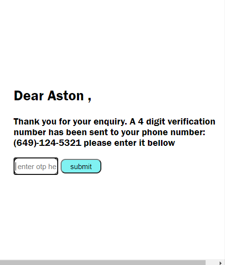

Hi there,

These is a registration form created using HTML, CSS & JAVASCRIPT.

The form consist of 3 Inputs

Full Name: aston roy

EMAIL: aston@gmail.com

Phone Number: (651)-123-1234

`                                                               `Validation

Fullname : (only alphabets and spaces allowed, min two words each with min 4 chars)

Email: (Email validation)

Phone number (Pay attention to this format as per below instructions)

- Only numbers to be allowed to type
- make the number appear like (123) - 456 - 7890 
  - the user is not allowed to add spaces/brackets/hyphens, that should be handled by the script and it should happen in real time and not after all the 10 digits are typed in.
- The first 3 digits represent the mobile provider and its logo should appear beside the box, based on following conditions
  - if the 3 digits fall between 621 - 799, then its Reliance Jio
  - if the 3 digits fall between 801 - 920, then its Idea
  - if the 3 digits fall between 921 - 999 then its Vodafone
  - everything else is an invalid number. 
- The next 3 digits, represent the state in India. 
  - I will let you to decide which number represents which state but there has to be only 36 valid numbers (28 states and 8 UTs)
  - show the state name beside the mobile provider beside the box, eg Jio, Maharashtra.
  - everything else is an invalid number
- Last 4 digits could be any combination.

Submit Button

`                   `

